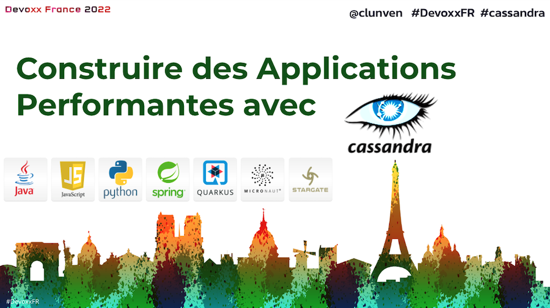
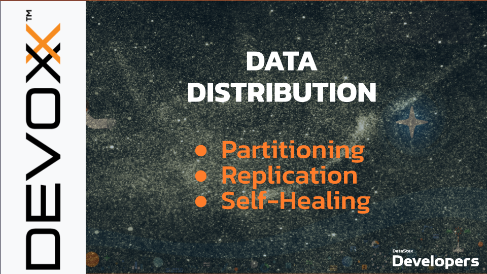
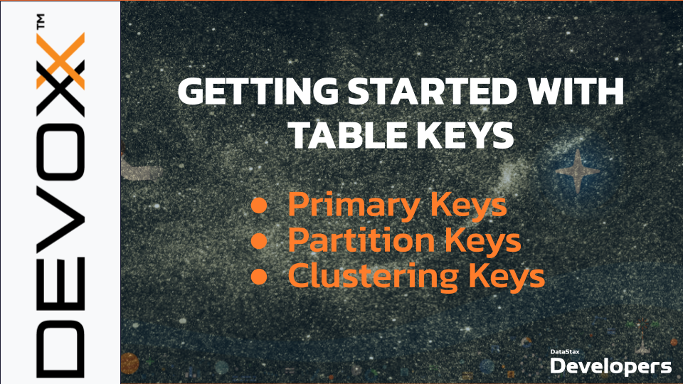
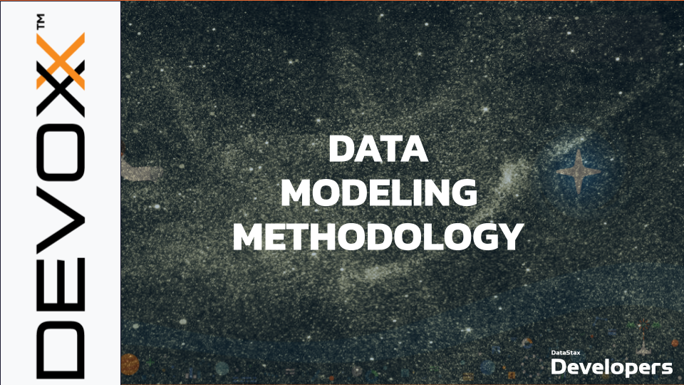
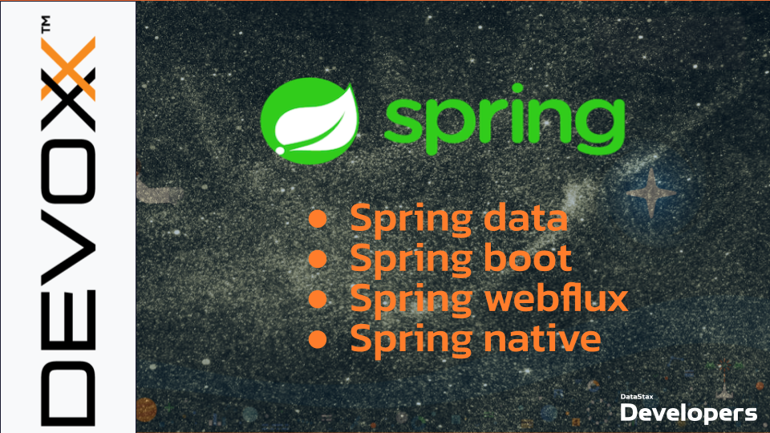
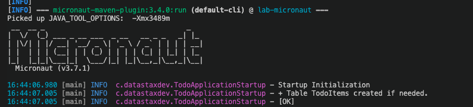

## 🧑🏻‍💻 🧑🏾‍💻 A Java developer Journey into Apache Cassandra™ 👩🏿‍💻 👩‍💻
 
[](http://www.apache.org/licenses/LICENSE-2.0)
[](https://gitpod.io/#https://github.com/datastaxdevs/conference-2022-devoxx)

 
ℹ️ **About this Session**
 
> During this deep-dive session, we will give you everything you need to master this technology: from <b>architecture</b> to <b>data modeling</b>, from <b>drivers to</b> best practices.</b> Through practical labs requiring no installation, we will browse and run applications implemented with Spring Boot, Quarkus, and Micronaut in order to see how Apache Cassandra™ can be used in modern java applications.
 


⏲️ **Duration :** `3 hours`
 
🎓 **Level** `Intermediate`
 
## 📋 Table of content
 
- [Objectives](#objectives)
- [Materials](#materials)
- [**1. Introduction to Cassandra** *(slides)*]()
- [**2. Environment Setup**](#2-environment-setup)
 - [2.1 - Prerequisites](#21---prerequisites)
 - [2.2 - Start `Gitpod`](#22---start-gitpod)
 - [2.3 - Start Apache Cassandra™ cluster](#23---start-apache-cassandra-cluster)
 - [2.4 - Scale the cluster up](#24---scale-the-cluster-up)
 - [2.5 - Create keyspace](#25---create-keyspace)
- [**3. Connectivity**](#3-connectivity)
 - [3.1 - Introduction to Drivers *(slides)*](#31---introduction-to-driver)
 - [3.2 - Connect with drivers](#32---connect-with-drivers)
 - [3.3 - Drivers Configuration](#33---drivers-configuration)
- [**4. Data Distribution** *(slides)*](#4-data-distribution)
- [**5. Working with CQL**](#5-working-with-cql)
 - [5.1 - Understanding table key *(slides)*](#51---understanding-table-keys)
 - [5.2 - Schema Definition](#52---schema-definition)
 - [5.3 - CRUD Operations](#53---crud-operations)
 - [5.4 - Advanced Data Types](#54---advanced-data-types)
 - [5.5 - Advanced Concepts](#55---advanced-concepts)
- [**6. Data Modeling**](#6-data-modeling)
 - [6.1 - Data Model Methodology *(slides)*](#61---data-model-methodology)
 - [6.2 - Data Modeling In action](#62---data-modeling-in-action)
 - [6.3 - From SQL to NoSQL Migration  *(slides)*](#63---from-sql-to-nosql-migration)
- [**7. Working with Spring Framework**](#7-working-with-spring-framework)
 - [7.1 - Spring Data Connection and Configuration](#71---spring-data-connection-and-configuration)
 - [7.2 - `CassandraRepository` and `CrudRepository`](#72---cassandrarepository-and-crudrepository)
 - [7.3 - `CassandraOperations`](#73---cassandraoperations)
 - [7.4 - Spring Boot (mvc, Webflux)](#74---spring-boot-mvc-webflux)
 - [7.5 - Spring Native](#75---spring-native)
- [**8. Working with Quarkus**](#8-working-with-quarkus)
 - [8.1 - Quarkus extension *(slides)*](#81---quarkus-extension)
 - [8.2 - Application Walkthrough](#82---application-walkthrough)
 - [8.3 - Native Image](#83---native-image)
- [**9. Working with Micronaut**](#9-working-with-micronaut)
 - [9.1 - Micronaut Philosophy  *(slides)*](#91---micronaut-philosophy)
 - [9.2 - Application Walkthrough](#92---application-walkthrough)
 - [9.3 - Native Image](#93---native-image)
 
---
## Objectives
 
1. 🎯 Discover what the NoSQL Database Apache Cassandra is and what are the relevant **use cases**
2. 🎯 Understand how Apache Cassandra™ is different from relational database in the philosophy and **data modeling**.
3. 🎯 Practice on how **Java Applications** connect to the databases, what are the rules and things to know.
4. 🎯 Learn how to work with Cassandra notions through the drivers, CRUD, Advanced Data Types, Batches, Lightweight transactions
5. 🎯 Setup a Spring Boot application leverating Cassandra, Spring Data and Spring Boot
6. 🎯 Setup Quarkus applications leveraging Cassandra
7. 🎯 Setup Micronaut Boot applications leverating Cassandra
8. 🎯 Work with GraalVm and native compilation
 
## Materials
 
It doesn't matter if you join the presentation live or you prefer to work at your own pace later, we have you covered. In this repository, you'll find everything you need for this workshop:
 
- [Slide deck](content/slides.pdf)
- [Datastax Developers Discord chat](https://bit.ly/cassandra-workshop)
- [Questions and Answers](https://community.datastax.com/)
 
## 1. Introduction to Cassandra

_This placeholder mark a moment to pay attention to the speaker_


## 2. Environment Setup
 
### 2.1 - Prerequisites
 
Instructions are provided to you to work within `gitpod` cloud IDE. Intention is to easily execute the steps with no installation required. You can of course use your own laptop and those are the tools you will need:
 
#### 📦 Docker
> - Use the [reference documentation](https://www.docker.com/products/docker-desktop) to install **Docker Desktop**
> - Validate your installation with
> ```bash
>
> docker -v
> docker run hello-world
> ```
 
#### 📦 Java Development Kit (JDK) 17+
> - Use the [reference documentation](https://docs.oracle.com/javase/8/docs/technotes/guides/install/install_overview.html) to install a >**Java Development Kit**
> - Validate your installation with
>
> ```bash
> java --version
> ```
 
#### 📦 Apache Maven (3.6+)
> - Use the [reference documentation](https://maven.apache.org/install.html) to install **Apache Maven**
> - Validate your installation with
>
> ```bash
> mvn -version
> ```
 
#### 📦 GraalVM (22.1.r17+)
> - Use the [reference documentation](https://www.graalvm.org/22.0/docs/getting-started/#install-graalvm) to install **GraalVM**
>
> - Validate your installation with
>
> ```bash
> lli --version
> gu --version
> ```
 
### 2.2 - Start `Gitpod`
 
[Gitpod](https://www.gitpod.io/) is a Free IDE provided as Saas. He leverages [VS Code](https://github.com/gitpod-io/vscode/blob/gp-code/LICENSE.txt?lang=en-US) and comes loaded with all tools needed to develop with multiple languages.
 
#### `✅.001`- _Right Click_ to open Gitpod in a new browser tab.
 
[](https://gitpod.io/#https://github.com/datastaxdevs/conference-2022-devoxx)
 
### 2.3 - Start Apache Cassandra™ cluster
 
Once gitpod has launched you should find a couple of terminals available. Locate `setup`, you will get this message.
 
```
------------------------------------------------------------
---            Welcome to Devoxx  2022                   ---
------------------------------------------------------------
```
 
ℹ️ **Copy-Paste in Gitpod**
> For the first `copy-paste` within `Gitpod` you are invited to authorize them. Please do so to keep moving in the session.
 
In `setup` locate  `docker-compose.yml`. We will run the Cassandra  [official image™](https://hub.docker.com/_/cassandra/).
 
#### `✅.002`- Open the file and visualize the file, check how `seed` service is isolated from others. Recommendation is one `seed` per rack (2 / 3 `seeds` per ring/dc)
 
```bash
gp open /workspace/conference-2022-devoxx/setup/docker-compose.yml
```
 
#### `✅.003`- Start first 2 nodes with `docker-compose`
 
```bash
cd /workspace/conference-2022-devoxx/setup/
docker-compose up -d
```
 
> 🖥️ Result
>
> ```
> Creating network "setup_cassandra" with the default driver
> Creating setup_dc1_seed_1 ... done
> Creating setup_dc1_node_1 ... done
> ```
 
#### `✅.004`- Display containers status with `docker`
 
2 containers will start (services). The second one will wait 30s for the seed to bootstrap.
 
```bash
docker ps
```
 
#### `✅.005`- Display containers status with `docker-compose`
 
```bash
docker-compose ps
```
 
> 🖥️ Results
>
> ```bash
>     Name                    Command               State                                        Ports
> --------------------------------------------------------------------------------------------------------------------------------------------
> setup_dc1_node_1    docker-entrypoint.sh /bin/ ...   Up      7000/tcp, 7001/tcp, 7199/tcp, 9042/tcp, 9160/tcp
> setup_dc1_seed_1    docker-entrypoint.sh cassa ...   Up      7000/tcp, 7001/tcp, 7199/tcp, 0.0.0.0:9042->9042/tcp,:::9042->9042/tcp, 9160/tcp
> ```
 
#### `✅.006`- Save `seed` container id
 
In order for us to use tools like `cqlsh` and `nodetool` we have to access the container shell. here we save container id to ease future commands.
 
```bash
export dc1_seed_containerid=`docker ps | grep dc1_seed | cut -b 1-12`
echo "Seed container ID has been saved : $dc1_seed_containerid"
```
 
#### `✅.007`- Display cluster with `nodetool`
 
```
docker exec -it $dc1_seed_containerid nodetool status
```
 
> 🖥️ Result
>
> ```
> Datacenter: dc1
> ===============
> Status=Up/Down
> |/ State=Normal/Leaving/Joining/Moving
> --  Address     Load       Tokens  Owns (effective)  Host > ID                               Rack
> UN  172.28.0.2  69.05 KiB  16      100.0%8707bea1-ac47-4da0-9e96-5541d3e1431d  rack1
> UN  172.28.0.3  69.05 KiB  16      100.0%            25f43936-be10-471d-b8ac-7efe93834712  rack1
> ```
 
We expect nodes `states` to be `UN`(Up/Normal).
 
### 2.4 - Scale the cluster up
 
#### `✅.008`- Add a third node in the cluster (scale up of the non-seed node).
 
```bash
docker-compose up --scale dc1_node=2 -d
```
 
The command will also restart `dc1_node` unfortunately `docker-compose scale` is deprecated. We did not provide any volume so no harm also as the seed is still present the nodes wi.l synchronize.
 
To properly deploy Cassandra in Docker for a multi node configuration you should consider Kubernetes and particularly [k8ssandra.io](k8ssandra.io).
 
> 🖥️ `Result `
> ```
> gitpod /workspace/conference-2022-devoxx/setup (main) $ docker-compose up --scale dc1_node=2 -d
> [+] Running 3/3
> ⠿ Container setup-dc1_seed-1  Running                                                                                                                     0.0s
> ⠿ Container setup-dc1_node-2  Running                                                                                                                     5.3s
> ⠿ Container setup-dc1_node-1  Started                                                                                                                     5.3s
> ```
>.
 
#### `✅.009`- Check Status
 
Wait about a minute for nodes to have time to properly join the cluster.
 
```bash
docker exec -it $dc1_seed_containerid nodetool status
```
 
> 🖥️ Result
>
> ```
> Datacenter: dc1
> ===============
> Status=Up/Down
> |/ State=Normal/Leaving/Joining/Moving
> --  Address     Load       Tokens  Owns (effective)  Host > ID                               Rack
> UN  172.28.0.2  69.05 KiB  16      100.0%8707bea1-ac47-4da0-9e96-5541d3e1431d  rack1
> UN  172.28.0.3  69.05 KiB  16      100.0%            25f43936-be10-471d-b8ac-7efe93834712  rack1
> UN  172.28.0.4  69.06 KiB  16      76.0%             fe43b0d0-952b-48ec-86e1-d73ace617dc8  rack1
> ```
 
### 2.5 - Create keyspace
 
#### `✅.010`- Open REPL CQLSH
 
This tool is available as part of Cassandra installation.  `C.Q.L` stands for _Cassandra Query Language_ and `sh` for shell.
 
```bash
docker exec -it $dc1_seed_containerid cqlsh
```
 
#### `✅.011`- Display local node informations
 
Table `system.local` contains information relative to the current node (here `dc1_seed`).
 
```sql
select cluster_name,data_center,rack,broadcast_address
from system.local;
```
 
> 🖥️ Result
>
> ```
>  cluster_name | data_center | rack  | broadcast_address
> --------------+-------------+-------+-------------------
>       handson |         dc1 | rack1 |        172.28.0.2
>
> (1 rows)
> ```
 
#### `✅.012`- Display information for the 2 others nodes
 
Information for other nodes are stored in `system.peers`.
 
```sql
select data_center,rack,peer
from system.peers;
```
 
> 🖥️ Result
>
> ```
> cqlsh> select data_center,rack,peer from system.peers;
>
> data_center | rack  | peer
> -------------+-------+------------
>         dc1 | rack1 | 172.28.0.4
>         dc1 | rack1 | 172.28.0.3
>
> (2 rows)
> ```
 
#### `✅.013`- Keyspace creation
 
A Keyspace is a logical grouping of objects. Best practice is to create a keyspace per application.
 
A single application can work with multiple `keyspaces` within the same session. It can be useful if some data needs to be replicated in different manners (the replication factor is per keyspace).
 
Let's create the keyspace `devoxx`.
 
```sql
CREATE KEYSPACE IF NOT EXISTS devoxx
WITH REPLICATION = {
 'class' : 'NetworkTopologyStrategy',
 'dc1' : 3
}  AND DURABLE_WRITES = true;
 
CREATE KEYSPACE IF NOT EXISTS devoxx_drivers
WITH REPLICATION = {
 'class' : 'NetworkTopologyStrategy',
 'dc1' : 3
}  AND DURABLE_WRITES = true;
 
CREATE KEYSPACE IF NOT EXISTS devoxx_spring
WITH REPLICATION = {
 'class' : 'NetworkTopologyStrategy',
 'dc1' : 3
}  AND DURABLE_WRITES = true;
 
CREATE KEYSPACE IF NOT EXISTS devoxx_quarkus
WITH REPLICATION = {
 'class' : 'NetworkTopologyStrategy',
 'dc1' : 3
}  AND DURABLE_WRITES = true;
 
CREATE KEYSPACE IF NOT EXISTS devoxx_micronaut
WITH REPLICATION = {
 'class' : 'NetworkTopologyStrategy',
 'dc1' : 3
}  AND DURABLE_WRITES = true;
```
 
⁉️ `NetworkTopologyStrategy`
 
> `NetworkTopologyStrategy` will always be used except for tests with a single node. Under those conditions you will use `SimpleReplicationStrategy`.
>
> ```sql
> CREATE KEYSPACE IF NOT EXISTS test_simple_strategy
> WITH REPLICATION = {
>   'class' : 'SimpleStrategy',
>   'replication_factor': '1'
> } AND DURABLE_WRITES = true;
> ```
 
⁉️ `DURABLE_WRITES`
 
> In Cassandra write path, Data will be written first into memory  (`memtable`). Then data is _flushed_  on disk into immutable files (SSTABLE). This will happen whether by vacation or when a threshold in memory is reached.
>
> Using `DURABLE_WRITES = true` is a way to enable `commit log`: before writing into memory data will be persisted in an already open file on disk. It will prevent the loss of data if something goes wrong before data in memory is flushed. `True` is the default value.
 
#### `✅.014`- List keyspaces
 
- In Cqlsh:
```sql
describe keyspaces;
```
 
> 🖥️ Result
>
> ```
> devoxx            devoxx_quarkus  system_auth         system_traces       
> devoxx_drivers    devoxx_spring   system_distributed  system_views        
> devoxx_micronaut  system          system_schema       system_virtual_schema
> ```
 
## 3. Connectivity
 
### 3.1 - Introduction to Driver
 
_This placeholder mark a moment to pay attention to the speaker_

 
### 3.2 - Connect with drivers
 
- Check project `lab-cassandra-drivers` configuration file `pom.xml`
 
```
gp open /workspace/conference-2022-devoxx/lab-cassandra-drivers/pom.xml
```
 
#### `✅.015`- Run  `E00_TestConnectivityTest`
 
```
cd /workspace/conference-2022-devoxx/lab-cassandra-drivers
gp open /workspace/conference-2022-devoxx/lab-cassandra-drivers/src/test/java/com/datastax/devoxx/E00_ConnectivityTest.java
mvn test -Dtest=com.datastax.devoxx.E00_ConnectivityTest
```
 
### 3.3 - Drivers Configuration
 
- Check project `lab-cassandra-drivers` configuration file `application.conf`
 
```
gp open /workspace/conference-2022-devoxx/lab-cassandra-drivers/src/main/resources/application.conf
```
 
## 4. Data Distribution
 
_This placeholder mark a moment to pay attention to the speaker_

 
## 5. Working with CQL
 
### 5.1 - Understanding table keys
 
_This placeholder mark a moment to pay attention to the speaker_

 
### 5.2 - Schema Definition
 
We keep using `cqlsh` to illustrate what have been seen so far
 
#### `✅.016`- list Keyspaces
 
Check that `devoxx` is one of the keyspace
 
 _In shell setup:bash_

```sql
describe KEYSPACES;
```
 
#### `✅.017`- Select keyspace `devoxx`
 
```sql
use devoxx;
```
 
#### `✅.018`-  List Tables in keyspaces `devoxx`
 
No suspense, the schema is empty
 
```sql
desc tables;
```
 
#### `✅.019`- Create your first table
 
```sql
CREATE TABLE IF NOT EXISTS city_by_country (
 country     text,
 city        text,
 population  int,
 PRIMARY KEY ((country), city)
);
```
 
#### `✅.020`-  `E01_CreateSchemaTest.java`
 
_In shell tests:bash_
```
cd /workspace/conference-2022-devoxx/lab-cassandra-drivers
gp open /workspace/conference-2022-devoxx/lab-cassandra-drivers/src/test/java/com/datastax/devoxx/E01_CreateSchemaTest.java
mvn test -Dtest=com.datastax.devoxx.E01_CreateSchemaTest
```
 
### 5.3 - CRUD Operations
 
#### `✅.021`- Insert a few rows
 
```sql
INSERT INTO city_by_country(country, city, population)
VALUES('FR','Paris', 2187526);
 
INSERT INTO city_by_country(country, city, population)
VALUES('FR','Marseille', 863310);
 
INSERT INTO city_by_country(country, city, population)
VALUES('FR','Lyon', 516092);
 
INSERT INTO city_by_country(country, city, population)
VALUES('FR','Toulouse', 479553);
 
INSERT INTO city_by_country(country, city, population)
VALUES('FR','Nice', 340017);
 
INSERT INTO city_by_country(country, city, population)
VALUES('FR','Nantes', 309346);
 
INSERT INTO city_by_country(country, city, population)
VALUES('FR','Montpellier', 285121);
 
INSERT INTO city_by_country(country, city, population)
VALUES('FR','Strasbourg', 280966);
 
INSERT INTO city_by_country(country, city, population)
VALUES('FR','Bordeaux', 254436);
 
INSERT INTO city_by_country(country, city, population)
VALUES('FR','Lille', 232787);
 
INSERT INTO city_by_country(country, city, population)
VALUES('FR','Rennes', 216815);
 
INSERT INTO city_by_country(country, city, population)
VALUES('FR','Reims', 182460);
 
INSERT INTO city_by_country(country, city, population)
VALUES('FR','Saint-Etienne', 172565);
 
INSERT INTO city_by_country(country, city, population)
VALUES('FR','Toulon', 171953);
 
INSERT INTO city_by_country(country, city, population)
VALUES('FR','Le Havre', 170147);
 
INSERT INTO city_by_country(country, city, population)
VALUES('FR','Grenoble', 158454);
 
INSERT INTO city_by_country(country, city, population)
VALUES('FR','Dijon', 156920);
 
INSERT INTO city_by_country(country, city, population)
VALUES('FR','Angers', 150610);
 
INSERT INTO city_by_country(country, city, population)
VALUES('FR','Saint-Denis', 147931);
 
INSERT INTO city_by_country(country, city, population)
VALUES('FR','Villeurbanne', 147712);
 
INSERT INTO city_by_country(country, city, population)
VALUES('FR','Clermont-Ferrand', 143886);
 
INSERT INTO city_by_country(country, city, population)
VALUES('FR','Le Mans', 142946);
 
INSERT INTO city_by_country(country, city, population)
VALUES('FR','Aix-en-Provence', 142482);
 
INSERT INTO city_by_country(country, city, population)
VALUES('FR','Brest',  140064);
 
INSERT INTO city_by_country(country, city, population)
VALUES('FR','Tours', 135787);
 
INSERT INTO city_by_country(country, city, population)
VALUES('FR','Amiens', 134057);
 
INSERT INTO city_by_country(country, city, population)
VALUES('FR','Limoges', 132175);
 
INSERT INTO city_by_country(country, city, population)
VALUES('FR','Annecy', 126924);
 
INSERT INTO city_by_country(country, city, population)
VALUES('FR','Perpignan', 120158);
 
INSERT INTO city_by_country(country, city, population)
VALUES('USA','New York', 8000000);
 
INSERT INTO city_by_country(country, city, population)
VALUES('USA','Los Angeles', 4000000);
 
INSERT INTO city_by_country(country, city, population)
VALUES('DE','Berlin', 3350000);
 
INSERT INTO city_by_country(country, city, population)
VALUES('UK','London', 9200000);
 
INSERT INTO city_by_country(country, city, population)
VALUES('AU','Sydney', 4900000);
 
INSERT INTO city_by_country(country, city, population)
VALUES('DE','Nuremberg', 500000);
 
INSERT INTO city_by_country(country, city, population)
VALUES('CA','Toronto', 6200000);
 
INSERT INTO city_by_country(country, city, population)
VALUES('CA','Montreal', 4200000);
 
INSERT INTO city_by_country(country, city, population)
VALUES('JP','Tokyo', 37430000);
 
INSERT INTO city_by_country(country, city, population)
VALUES('IN','Mumbai', 20200000);
```
 
#### `✅.022`- List records in table
 
```sql
select * from city_by_country;
```
 
#### `✅.023`- List french cities
 
<p/>
<details>
<summary>Click to display solution</summary>
 
```sql
select * from city_by_country
WHERE country='FR';
```
</details>
<p/>
 
#### `✅.024`- List cities for country `CA` or `DE` using `IN`
 
<p/>
<details>
<summary>Click to display solution</summary>
 
```sql
select * FROM city_by_country
WHERE country IN('CA', 'DE');
```
 
</details>
<p/>
 
#### `✅.025`- Search for city `Brest` (in France `FR`)
 
<p/>
<details>
<summary>Click to show solution</summary>
 
```sql
select * from city_by_country
WHERE country='FR'
AND city='Brest';
```
 
</details>
<p/>
 
#### `✅.026`- Search for french cities where first letter is `P`
 
<p/>
<details>
<summary>Click to show solution</summary>

```sql
SELECT * FROM city_by_country
WHERE country='FR'
AND city>'P';
```
</details>
<p/>
 
#### `✅.027`- Update Brest population to `142000` inhabitants
 
<p/>
<details>
<summary>Click to show solution</summary>
 
*with Update statement*
```sql
update city_by_country
SET population=142000
WHERE country='FR'
AND city='Brest';
```
 
*with Insert (as any insert is also an upset)*
```sql
INSERT INTO city_by_country(country, city, population)
VALUES('FR','Brest',  142000);
```
 
</details>
<p/>
 
#### `✅.028`- Delete row with city of `Tokyo`
 
<p/>
<details>
<summary>Click to show solution</summary>
 
```sql
DELETE FROM city_by_country
WHERE country='JP'
AND city='Tokyo';
```
 
*Check:*
```sql
select * from city_by_country
WHERE country='JP';
```
 
</details>
<p/>
 
ℹ️ **Note**:
> When you delete a record in Cassandra it is not really deleted on disk, it creates a marker called a  `Tombstone` that needs to be cleaned during an operation called compaction. If you miss some space on disk, deleting here is not a good solution.
 
#### `✅.029`- Delete rows related to country Canada `(CA)`
 
<p/>
<details>
<summary>Click to show solution</summary>
 
```sql
DELETE FROM city_by_country
WHERE country='CA';
```
 
*Vérification:*
```sql
select * from city_by_country
WHERE country='CA';
```
 
</details>
<p/>
 
#### `✅.030`- Delete row for country `AU` and city `Sydney`
 
<p/>
<details>
<summary>Click to show solution</summary>
 
```sql
DELETE population
FROM city_by_country
WHERE country='AU'
AND city='Sydney';
```
 
*Vérification:*
```sql
SELECT * from city_by_country
WHERE country='AU';
```
 
</details>
<p/>
 
⚠️ **Important**
> ```
> It is possible to do it, it is not recommended, it will move
> the load from the client application the coordinator, issue
> parallel request if you have to do it (N+1 select)
> ```
 
#### `✅.031`- Use `GROUP BY` and average function `AVG`
 
- Show average population grouped by country
 
```sql
SELECT country, AVG(CAST(population AS FLOAT)) AS avg_population
FROM city_by_country
GROUP BY country;
```
 
#### `✅.032`- Use `GROUP BY` and function `COUNT`
 
- Show number of cities per country
 
```sql
SELECT country, count(city) as nb_villes
FROM city_by_country
GROUP BY country;
```
 
#### `✅.033`- Clean the table
 
To avoid creating tombstones we will use `TRUNCATE` instead of `DELETE`.
 
```sql
TRUNCATE city_by_country;
```
 
### `✅.034`- Execute statements with Java
 
_In terminal `tests:bash`_
```
cd /workspace/conference-2022-devoxx/lab-cassandra-drivers
gp open /workspace/conference-2022-devoxx/lab-cassandra-drivers/src/test/java/com/datastax/devoxx/E02_StatementsTest.java
mvn test -Dtest=com.datastax.devoxx.E02_StatementsTest
```
 
### `✅.035`- Create read update Delete
 
_In terminal `tests:bash`_
```
cd /workspace/conference-2022-devoxx/lab-cassandra-drivers
gp open /workspace/conference-2022-devoxx/lab-cassandra-drivers/src/test/java/com/datastax/devoxx/E03_OperationsCrudTest.java
mvn test -Dtest=com.datastax.devoxx.E03_OperationsCrudTest
```
 
## 5.4 - Advanced Data Types
 
There a lot of different simple scalar types in CQL : `VARCHAR`, `ASCII`, `TINYINT`, `SMALLINT`, `INT`, `BIGINT`, `VARINT`, `FLOAT`, `DOUBLE`, `DECIMAL`, `TIME`, `TIMESTAMP`, `DATE`, `DURATION`, `BOOLEAN`, `BLOB`, et `INET`. Here is the [complete list](https://docs.datastax.com/en/cql-oss/3.x/cql/cql_reference/cql_data_types_c.html).
 
#### `✅.036`- Working with `UUID`
 
_Back to terminal `setup:bash`_

```sql
drop table if exists users;
CREATE TABLE IF NOT EXISTS users (
 id UUID,
 name TEXT,
 age INT,
 PRIMARY KEY ((id))
);
 
INSERT INTO users (id, name, age)
VALUES (7902a572-e7dc-4428-b056-0571af415df3, 'Joe', 25);
 
INSERT INTO users (id, name, age)
VALUES (uuid(), 'Jen', 27);
 
SELECT * FROM users;
```
 
#### `✅.037`- Working with `SET`
 
```sql
drop table if exists movies;
CREATE TABLE movies (
 id UUID,
 title TEXT,
 year INT,
 duration INT,
 PRIMARY KEY ((id))
);
 
INSERT INTO movies (id, title, year, duration)
VALUES (5069cc15-4300-4595-ae77-381c3af5dc5e,
'Alice au pays des Merveilles', 2010, 108);
 
INSERT INTO movies (id, title, year, duration)
VALUES (uuid(), 'Alice', 1951, 75);
 
ALTER TABLE movies
ADD production SET<TEXT>;
 
UPDATE movies
SET production = { 'Walt Disney Pictures',
                  'Roth Films' }
WHERE id = 5069cc15-4300-4595-ae77-381c3af5dc5e;
 
UPDATE movies
SET production = production + { 'Team Todd' }
WHERE id = 5069cc15-4300-4595-ae77-381c3af5dc5e;
 
SELECT title, year, production FROM movies;
```
 
#### `✅.038`- Working with `LIST`
 
```sql
ALTER TABLE users
ADD searches LIST<TEXT>;
 
UPDATE users
SET searches = [ 'Alice au pays des merveilles' ]
WHERE id = 7902a572-e7dc-4428-b056-0571af415df3;
 
UPDATE users
SET searches = searches + [ 'Comedies' ]
WHERE id = 7902a572-e7dc-4428-b056-0571af415df3;
 
UPDATE users
SET searches = searches + [ 'Alice au pays des merveilles' ]
WHERE id = 7902a572-e7dc-4428-b056-0571af415df3;
 
SELECT id, name, searches FROM users;
 
```
 
#### `✅.039`- Working with `MAP`
 
```sql
ALTER TABLE users ADD sessions MAP<TIMEUUID,INT>;
SELECT name, sessions FROM users;
 
UPDATE users
SET sessions = { now(): 32, e22deb70-b65f-11ea-9aac-99396fc4f757: 7 }
WHERE id = 7902a572-e7dc-4428-b056-0571af415df3;
 
SELECT name, sessions FROM users;
 
UPDATE users
SET sessions[e22deb70-b65f-11ea-9aac-99396fc4f757] = 9
WHERE id = 7902a572-e7dc-4428-b056-0571af415df3;
 
SELECT name, sessions FROM users;
 
ALTER TABLE movies
ADD crew MAP<TEXT,FROZEN<LIST<TEXT>>>;
SELECT title, year, crew FROM movies;
 
UPDATE movies
SET crew = {
 'cast': ['Johnny Depp', 'Mia Wasikowska'],
 'directed by': ['Tim Burton']
}
 
WHERE id = 5069cc15-4300-4595-ae77-381c3af5dc5e;
SELECT title, year, crew FROM movies;
```
 
#### `✅.040`- Working with `TUPLES`
 
```sql
ALTER TABLE users ADD full_name TUPLE<TEXT,TEXT,TEXT>;
 
UPDATE users
SET full_name = ('Joe', 'The', 'Great')
WHERE id = 7902a572-e7dc-4428-b056-0571af415df3;
 
SELECT name, full_name FROM users;
```
 
#### `✅.041`- Working with `UDT`
 
```sql
CREATE TYPE IF NOT EXISTS ADDRESS (
   street  TEXT,
   city    TEXT,
   state   TEXT,
   zipcode INT
);
 
ALTER TABLE users ADD address ADDRESS;
SELECT name, address FROM users;
 
UPDATE users
SET address = { street: '1100 Congress Ave',
               city: 'Austin',
               state: 'Texas',
               zipcode: 78701 }
WHERE id = 7902a572-e7dc-4428-b056-0571af415df3;
 
SELECT name, address FROM users
WHERE id = 7902a572-e7dc-4428-b056-0571af415df3;
 
UPDATE users
SET address.state = 'TX'
WHERE id = 7902a572-e7dc-4428-b056-0571af415df3;
SELECT name,
      address.street      AS street,
      address.city        AS city,
      address.state       AS state,
      address.zipcode     AS zip
FROM users
WHERE id = 7902a572-e7dc-4428-b056-0571af415df3;
```
 
#### `✅.042`- Execute List, Set, Map, Udt
 
_In terminal `tests:bash`_

```
cd /workspace/conference-2022-devoxx/lab-cassandra-drivers
gp open /workspace/conference-2022-devoxx/lab-cassandra-drivers/src/test/java/com/datastax/devoxx/E04_ListSetMapAndUdtTest.java
mvn test -Dtest=com.datastax.devoxx.E04_ListSetMapAndUdtTest
```
 
#### `✅.043`- Working with counters
 
 _In terminal `setup:bash`_

```sql
-- Create dedicated table
CREATE TABLE movie_stats (
 id UUID,
 num_ratings COUNTER,
 sum_ratings COUNTER,
 PRIMARY KEY ((id))
);
 
-- Insert a record with num_ratings=1  and sum_ratings=7
UPDATE movie_stats
SET num_ratings = num_ratings + 1,
   sum_ratings = sum_ratings + 7
WHERE id = 5069cc15-4300-4595-ae77-381c3af5dc5e;
 
-- num_ratings+=1 et sum_ratings+=7
UPDATE movie_stats
SET num_ratings = num_ratings + 1,
   sum_ratings = sum_ratings + 9
WHERE id = 5069cc15-4300-4595-ae77-381c3af5dc5e;
 
SELECT * FROM movie_stats;
```
 
#### `✅.044`- Works with counters in JAVA
 
  _In terminal `test:bash`_

```
cd /workspace/conference-2022-devoxx/lab-cassandra-drivers
gp open /workspace/conference-2022-devoxx/lab-cassandra-drivers/src/test/java/com/datastax/devoxx/E05_CountersTest.java
mvn test -Dtest=com.datastax.devoxx.E05_CountersTest
```
 
#### `✅.045`- Working with `JSON`
 

_In terminal `setup:bash`_

```sql
CREATE TYPE IF NOT EXISTS video_format (
 width   int,
 height  int
);
 
CREATE TABLE IF NOT EXISTS videos (
videoid   uuid,
title     text,
upload    timestamp,
email     text,
url       text,
tags      set <text>,
frames    list<int>,
formats   map <text,frozen<video_format>>,
PRIMARY KEY (videoid)
);
 
INSERT INTO videos(videoid, email, title, upload, url, tags, frames, formats)
VALUES(uuid(), 'clu@sample.com', 'sample video',
    toTimeStamp(now()), 'http://google.fr',
    { 'cassandra','accelerate','2020'},
    [ 1, 2, 3, 4],
    { 'mp4':{width:1,height:1},'ogg':{width:1,height:1}});
 
INSERT INTO videos(videoid, email, title, upload, url)
VALUES(uuid(), 'clu@sample.com', 'video2', toTimeStamp(now()), 'http://google.fr');
 
select videoid, email, title from videos;
 
INSERT INTO videos JSON '{
  "videoid":"e466f561-4ea4-4eb7-8dcc-126e0fbfd573",
    "email":"clunven@sample.com",
    "title":"A video inserted with JSON",
    "upload":"2020-02-26 15:09:22 +00:00",
    "url": "http://google.fr",
    "frames": [1,2,3,4],
    "tags":   [ "cassandra","accelerate", "2020"],
    "formats": {
       "mp4": {"width":1,"height":1},
       "ogg": {"width":1,"height":1}
    }
}';
 
select JSON * from videos
WHERE videoid=e466f561-4ea4-4eb7-8dcc-126e0fbfd573;
```
 
#### `✅.046`- With Java
 
_In terminal `test:bash`_

```
cd /workspace/conference-2022-devoxx/lab-cassandra-drivers
gp open /workspace/conference-2022-devoxx/lab-cassandra-drivers/src/test/java/com/datastax/devoxx/E06_JsonTest.java
mvn test -Dtest=com.datastax.devoxx.E06_JsonTest
```
 
### 5.5 - Advanced Concepts
 
#### `✅.047`- Working with `Batches`
 
- Single Partition
 
```sql
CREATE TABLE shopping_cart (
 cart_id   UUID,
 title     TEXT,
 year      INT,
 price     DECIMAL,
 user      TEXT STATIC,
 total     DECIMAL STATIC,
 PRIMARY KEY ((cart_id), title, year)
);
 
BEGIN BATCH
 INSERT INTO shopping_cart
        (cart_id, title, year, price, user)
 VALUES (b7255608-4a42-4829-9b84-a355e0e5100d,
        'Alice au pays des merveilles', 2010, 1.99,
        'joe@datastax.com');
 
 INSERT INTO shopping_cart
        (cart_id, title, year, price, user)
 VALUES (b7255608-4a42-4829-9b84-a355e0e5100d,
        'Alice', 1951, 0.99,
        'joe@datastax.com');
 
 INSERT INTO shopping_cart (cart_id, total)
 VALUES (b7255608-4a42-4829-9b84-a355e0e5100d, 2.98)
 IF NOT EXISTS;
APPLY BATCH;
 
SELECT total, price, title, year
FROM shopping_cart
WHERE cart_id = b7255608-4a42-4829-9b84-a355e0e5100d;
```
 
#### `✅.048`- Multiple partitions
 
```sql
CREATE TABLE  IF NOT EXISTS ratings_by_user (
 email TEXT,
 title TEXT,
 year INT,
 rating INT,
 PRIMARY KEY ((email), title, year)
);
 
CREATE TABLE  IF NOT EXISTS ratings_by_movie (
 title TEXT,
 year INT,
 email TEXT,
 rating INT,
 PRIMARY KEY ((title, year), email)
);
 
BEGIN BATCH
 INSERT INTO ratings_by_user (email, title, year, rating)
 VALUES ('joe@datastax.com', 'Alice aux pays des merveilles', 2010, 9);
 INSERT INTO ratings_by_movie (email, title, year, rating)
 VALUES ('joe@datastax.com', 'Alice aux pays des merveilles', 2010, 9);
APPLY BATCH;
 
BEGIN BATCH
 UPDATE ratings_by_user SET rating = 10
 WHERE email = 'joe@datastax.com'
   AND title = 'Alice aux pays des merveilles'
   AND year  = 2010;
 UPDATE ratings_by_movie SET rating = 10
 WHERE email = 'joe@datastax.com'
   AND title = 'Alice aux pays des merveilles'
   AND year  = 2010;
APPLY BATCH;
```
 
#### `✅.049`- With Java
 
 _In terminal `test:bash`_

```
cd /workspace/conference-2022-devoxx/lab-cassandra-drivers
gp open /workspace/conference-2022-devoxx/lab-cassandra-drivers/src/test/java/com/datastax/devoxx/E07_BatchesTest.java
mvn test -Dtest=com.datastax.devoxx.E07_BatchesTest
```
 
#### `✅.050`- Consistency LEVEL
 
As of we do have a single datacenter `dc1`  with 3 nodes like the picture below
 

 
- Execute the following
 
```sql
CONSISTENCY;
```

```sql
CONSISTENCY LOCAL_QUORUM;
TRACING ON;
 SELECT country,city, population
FROM city_by_country
WHERE country='DE';
```

```sql
CONSISTENCY ONE;
SELECT country,city, population
FROM city_by_country
WHERE country='DE';
CONSISTENCY LOCAL_QUORUM;
TRACING OFF;
```
 
#### `✅.051`- LightWeight Transactions (LWT)
 
- Insert only once with `IF NOT EXISTS`

```sql
CREATE TABLE sample_lwt (
 username TEXT,
 email TEXT,
 name TEXT,
 password TEXT,
 reset_token UUID,
 PRIMARY KEY ((username))
);
 
INSERT INTO sample_lwt (username, email, name)
VALUES ('dragonslayer', 'joe@datastax.com', 'Joe')
IF NOT EXISTS;
 
INSERT INTO sample_lwt (username, email, name)
VALUES ('dragonslayer', 'jen@datastax.com', 'Jen')
IF NOT EXISTS;
 
SELECT * FROM sample_lwt
WHERE username = 'dragonslayer';
```
 
#### `✅.052`- Password Reset
 
```sql
UPDATE sample_lwt
USING TTL 3600
SET reset_token = 6ef95fd0-9ae0-11ea-a9d2-d777ab7dec9e
WHERE username = 'devoxx_developer';
 
SELECT * FROM sample_lwt
WHERE username = 'devoxx_developer';
```

```sql
UPDATE sample_lwt
SET reset_token = null, password = 'encrypted password'
WHERE username = 'devoxx_developer'
IF reset_token = 6ef95fd0-9ae0-11ea-a9d2-d777ab7dec9e;

SELECT * FROM sample_lwt
WHERE username = 'devoxx_developer';
```

```sql
UPDATE sample_lwt
SET reset_token = null, password = 'malicious password'
WHERE username = 'devoxx_developer'
IF reset_token = 6ef95fd0-9ae0-11ea-a9d2-d777ab7dec9e;

SELECT * FROM sample_lwt
WHERE username = 'devoxx_developer';
```
 
#### `✅.053`- Coding LightWeight transactions
 
_In terminal `test:bash`_

```
cd /workspace/conference-2022-devoxx/lab-cassandra-drivers
gp open /workspace/conference-2022-devoxx/lab-cassandra-drivers/src/test/java/com/datastax/devoxx/E08_LightweightTransactionsTest.java
mvn test -Dtest=com.datastax.devoxx.E08_LightweightTransactionsTest
```
 
#### `✅.054`- Coding Paging with drivers
 
_In terminal `test:bash`_

```
cd /workspace/conference-2022-devoxx/lab-cassandra-drivers
gp open /workspace/conference-2022-devoxx/lab-cassandra-drivers/src/test/java/com/datastax/devoxx/E09_ResultPagingTest.java
mvn test -Dtest=com.datastax.devoxx.E09_ResultPagingTest
```
 
#### `✅.055`- Asynchronous Programming
 
_In terminal `test:bash`_

```
cd /workspace/conference-2022-devoxx/lab-cassandra-drivers
gp open /workspace/conference-2022-devoxx/lab-cassandra-drivers/src/test/java/com/datastax/devoxx/E10_AsynchronousProgrammingTest.java
mvn test -Dtest=com.datastax.devoxx.E10_AsynchronousProgrammingTest
```
 
#### `✅.056`- Reactive Programming

_In terminal `test:bash`_

```
cd /workspace/conference-2022-devoxx/lab-cassandra-drivers
gp open /workspace/conference-2022-devoxx/lab-cassandra-drivers/src/test/java/com/datastax/devoxx/E11_ReactiveProgrammingTest.java
mvn test -Dtest=com.datastax.devoxx.E11_ReactiveProgrammingTest
```
 
#### `✅.057`- Object Mapping
 
_In terminal `test:bash`_

```
cd /workspace/conference-2022-devoxx/lab-cassandra-drivers
gp open /workspace/conference-2022-devoxx/lab-cassandra-drivers/src/test/java/com/datastax/devoxx/E13_ObjectMappingTest.java
mvn test -Dtest=com.datastax.devoxx.E13_ObjectMappingTest
```
 
## 6. Data Modeling
 
### 6.1 - Data Model Methodology
 
_This placeholder mark a moment to pay attention to the speaker_


 
### 6.2 - Data Modeling in action

> [Datastax Academy by sample](https://www.datastax.com/learn/data-modeling-by-example)
 
[](https://gitpod.io/#https://github.com/DataStax-Academy/data-modeling-sensor-data/)
 
### 6.3 - From SQL to NoSQL Migration
 
_This placeholder mark a moment to pay attention to the speaker_

 
# 7. Working with Spring Framework



## 7.1 - Spring Data Connection and Configuration
 
#### `✅.058`- Check Setup and keyspace `devoxx_spring`
 
```sql
describe keyspace devoxx_spring;
use devoxx_spring;
```
 
- Version Support
 
> | Drivers       | Spring-Data      | Spring Boot      |
> | ------------- | ---------------- | ---------------- |
> | Drivers `3.x` | `2.2` and before | `2.2` and before |
> | Drivers `4.x` | `3.x` and after  | `2.3` and before |
> | Drivers `4.x` | `4.x` and after  | `3.x` and before |
 
```xml
<dependency>
 <groupId>org.springframework.boot</groupId>
 <artifactId>spring-boot-starter-data-cassandra</artifactId>
</dependency>
```
 
```bash
cd /workspace/conference-2022-devoxx/lab-spring
mvn clean compile
```

```bash
gp open /workspace/conference-2022-devoxx/lab-spring/src/main/resources/application.yml
```
 
_application.yml_
 
```yaml
spring:
  cassandra:
    schema-action: create-if-not-exists
    keyspace-name: devoxx_spring
    contact-points: 127.0.0.1:9042
    local-datacenter: dc1
    request:
      timeout: 5s
      consistency: LOCAL_QUORUM
      page-size: 5000
    connection:
      connect-timeout: 10s
      init-query-timeout: 10s
    controlconnection:
      timeout: 10s
```
 
#### `✅.059`- Validate configuration
 
```bash
cd /workspace/conference-2022-devoxx/lab-spring
gp open /workspace/conference-2022-devoxx/lab-spring/src/test/java/com/datastax/todo/E01_SpringDataInitTest.java
mvn test -Dtest=com.datastax.todo.E01_SpringDataInitTest
```
 
## 7.2 - `CassandraRepository` and `CrudRepository
 
```sql
describe table todos;
```
 
#### `✅.060`- Using spring data  `CrudRepository`
 
```bash
cd /workspace/conference-2022-devoxx/lab-spring
gp open /workspace/conference-2022-devoxx/lab-spring/src/test/java/com/datastax/todo/E02_SpringDataRepositoryTest.java
mvn test -Dtest=com.datastax.todo.E02_SpringDataRepositoryTest
```
 
```sql
use devoxx_spring;
SELECT * FROM todos;
```
 
## 7.3 - `CassandraOperations`
 
#### `✅.061`- Using spring data  `CassandraOperations`
 
```bash
cd /workspace/conference-2022-devoxx/lab-spring
gp open /workspace/conference-2022-devoxx/lab-spring/src/test/java/com/datastax/todo/E03_SpringDataCassandraOperationsTest.java
mvn test -Dtest=com.datastax.todo.E03_SpringDataCassandraOperationsTest
```
 
## 7.4 - Spring Boot (mvc, Webflux)
 
#### `✅.062`- Start application with  `spring-boot` plugin
 
```bash
cd /workspace/conference-2022-devoxx/lab-spring
mvn spring-boot:run
```
 

 
```bash
gp url 8080
```
 
- Show list of todos `todos`
 
```
gp preview "$(gp url 8080)/api/v1/todos/"
```
 

 
```
http://localhost:8080/api/v1/todos/
```
 
#### `✅.063`- Integration Test
 
```bash
cd /workspace/conference-2022-devoxx/labs/lab5_spring_data
mvn test -Dtest=com.datastax.workshop.E04_SpringControllerTest
```
 
### 7.5 - Spring Native
 
#### `✅.064`- Compile Native version
 
```
mvn clean package -Pnative
```
 
#### `✅.065`- Run Native version
 
```
./target/lab-spring
```
 
# 8. Working with Quarkus


 
## 8.1 - Quarkus extension
 
[Quarkus](https://quarkus.io/) is a framework to build microservice on Java Platform. Purpose is to execute a maximum of actions at build time and package only what is needed. Main objectives are:
 
- Producing a native image with about a few megabytes only
- Producing a native image that can start in a few millis
 
A [Quarkus extension](https://quarkus.io/guides/writing-extensions) eases applications configuration and integration with third parties. The Datastax team created an extension for Cassandra [available here](https://github.com/datastax/cassandra-quarkus). Here are the underlying featuresL
 
- Reactive support of `Mutiny` (reactive layer in Quarkus)
- Integration with `vertx` and Quarkus event loop
- Declare Mappers in `Arc`, the dependency injection layer in Quarkus.
- Provide hints for the creation native image _aux petits oignons._
 
`cassandra-quarkus-client` is available on central maven[](https://maven-badges.herokuapp.com/maven-central/com.datastax.oss.quarkus/cassandra-quarkus-client)
 
 
```xml
<dependency>
 <groupId>com.datastax.oss.quarkus</groupId>
 <artifactId>cassandra-quarkus-client</artifactId>
 <version>${latest}</version>
</dependency>
```
 
Documentation for Cassandra support in Quarkus can be found [here](https://quarkus.io/guides/cassandra)
 
## 8.2 - Application Walkthrough
 
#### `✅.066`- Check Setup and keyspace `devoxx_spring`
 
```sql
describe keyspace devoxx_quarkus
use devoxx_quarkus;
```
 
```bash
cd /workspace/conference-2022-devoxx/lab-quarkus
mvn clean compile
```
 
#### `✅.067`- Validate configuration
 
```bash
gp open /workspace/conference-2022-devoxx/lab-quarkus/src/main/resources/application.properties
```
 
```
cd /workspace/conference-2022-devoxx/labs/lab6_quarkus
mvn test -Dtest=com.datastax.workshop.E01_QuarkusInit
```
 
#### `✅.068` - Using `CqlSession` with `Quarkus`
 
```
cd /workspace/conference-2022-devoxx/lab6-quarkus
mvn test -Dtest=com.datastax.workshop.E02_QuarkusCql
```
 
#### `✅.069` - Using `Quarkus` object mapping `ARC`  with Quarkus
 
```bash
cd /workspace/conference-2022-devoxx/lab-quarkus
mvn test -Dtest=com.datastax.workshop.E03_QuarkusObjectMapping
```
 
#### `✅.070` - Start `Quarkus` application
 
```bash
cd /workspace/conference-2022-devoxx/lab6-quarkus
mvn quarkus:dev -DskipTests
```
 
```bash
gp preview "$(gp url 8081)/q/dev"
```
 
```
http://localhost:8081/q/dev/
```
_Dashboard_

 
- Multiple plugins are provided out of the box like `swagger-ui` to test our API in a browser
 
```bash
gp preview "$(gp url 8081)/q/swagger-ui"
```
 
```
http://localhost:8081/q/swagger-ui
```
 

 
 
#### `✅.071` - Integration Test with `Quarkus`
 
Stop the application using `q`. Launch integration tests
 
```bash
cd /workspace/conference-2022-devoxx/lab-quarkus
mvn test -Dtest=com.datastax.workshop.E04_QuarkusController
```
 
### 8.3 - Native Image
 
#### `✅.072` - Build native image with  `Quarkus`
 
```
mvn clean package -Pnative
```
 
#### `✅.073` - Run the Quarkus native image
 
```
.target/lab-quarkus-0.0.1-SNAPSHOT-runner
```
 
Check health status.
 
# 9. Working with Micronaut
 


## 9.1 - Micronaut Philosophy
 
## 9.2 - Application Walkthrough
 
#### `✅.073` - list Keyspaces `devoxx_micronaut` should be there
 
```bash
describe keyspaces
```
 
> 🖥️ `output`
>
> ```
> devoxx            devoxx_quarkus  system_auth         system_traces       
> devoxx_drivers    devoxx_spring   system_distributed  system_views        
>devoxx_micronaut  system          system_schema       system_virtual_schema
>```
 
 
#### `✅.074` - Compile project
 
```bash
cd /workspace/conference-2022-devoxx/lab-micronaut/
mvn clean compile
```
 
#### `✅.4.1.d`- Testing project
 
```
cd /workspace/conference-2022-devoxx/lab-micronaut/
mvn test -Dtest=com.datastaxdev.E01_MicronautInitTest
```
 
> 🖥️ `OUTPUT`
> ```
> [INFO] -------------------------------------------------------
> [INFO]  T E S T S
> [INFO] -------------------------------------------------------
> [INFO] Running com.datastaxdev.E01_MicronautInitTest
> 12:57:12.946 [main] INFO  c.datastaxdev.TodoApplicationStartup - Startup Initialization
> 12:57:13.067 [main] INFO  c.datastaxdev.TodoApplicationStartup - + Table TodoItems created if needed.
> 12:57:13.067 [main] INFO  c.datastaxdev.TodoApplicationStartup - [OK]
> com.datastax.oss.driver.internal.core.session.DefaultSession@37854b34
> 12:57:13.108 [main] INFO  c.datastaxdev.E01_MicronautInitTest - Creating your CqlSession to Cassandra...
> 12:57:13.111 [main] INFO  c.datastaxdev.E01_MicronautInitTest - + [OK] Your are connected to keyspace ks_micronaut
> [INFO] Tests run: 1, Failures: 0, Errors: 0, Skipped: 0, Time elapsed: 7.677 s - in com.datastaxdev.E01_MicronautInitTest
> [INFO]
> [INFO] Results:
> [INFO]
> [INFO] Tests run: 1, Failures: 0, Errors: 0, Skipped: 0
> [INFO]
> [INFO] ------------------------------------------------------------------------
> [INFO] BUILD SUCCESS
> [INFO] ------------------------------------------------------------------------
> [INFO] Total time:  11.262 s
> [INFO] Finished at: 2022-10-04T12:57:15Z
> [INFO] ------------------------------------------------------------------------
 
 
#### `✅.4.1.e`- Use CqlSession
 
```
cd /workspace/conference-2022-devoxx/lab-micronaut/
mvn test -Dtest=com.datastaxdev.E02_MicronautCqlTest
```
 
> 🖥️ `OUTPUT`
> ```
> [INFO] -------------------------------------------------------
> [INFO]  T E S T S
> [INFO] -------------------------------------------------------
> [INFO] Running com.datastaxdev.E02_MicronautCqlTest
> 13:00:21.370 [main] INFO  c.datastaxdev.TodoApplicationStartup - Startup Initialization
> 13:00:21.482 [main] INFO  c.datastaxdev.TodoApplicationStartup - + Table TodoItems created if needed.
> 13:00:21.482 [main] INFO  c.datastaxdev.TodoApplicationStartup - [OK]
> 13:00:22.372 [main] INFO  com.datastaxdev.E02_MicronautCqlTest - Creating the schema...
> 13:00:22.456 [main] INFO  com.datastaxdev.E02_MicronautCqlTest - + [OK]
> 13:00:22.457 [main] INFO  com.datastaxdev.E02_MicronautCqlTest - Inserting Data
> 13:00:22.552 [main] INFO  com.datastaxdev.E02_MicronautCqlTest - + [OK]
> [INFO] Tests run: 1, Failures: 0, Errors: 0, Skipped: 0, Time elapsed: 8.28 s - in com.datastaxdev.E02_MicronautCqlTest
> [INFO]
> [INFO] Results:
> [INFO]
> [INFO] Tests run: 1, Failures: 0, Errors: 0, Skipped: 0
> [INFO]
> [INFO] ------------------------------------------------------------------------
> [INFO] BUILD SUCCESS
> [INFO] ------------------------------------------------------------------------
> [INFO] Total time:  11.441 s
> [INFO] Finished at: 2022-10-04T13:00:24Z
> [INFO] ------------------------------------------------------------------------
> ```
 
## 4.2 - Configuration
 
#### `✅.4.2.a`- Object Mapping
 
```bash
/workspace/conference-2022-devoxx/lab-micronaut/
mvn test -Dtest=com.datastaxdev.E03_MicronautObjectMappingTest
```
 
> 🖥️ `OUTPUT`
> ```
> [INFO] -------------------------------------------------------
> [INFO]  T E S T S
> [INFO] -------------------------------------------------------
> [INFO] Running com.datastaxdev.E03_MicronautObjectMappingTest
> 13:02:03.705 [main] INFO  c.datastaxdev.TodoApplicationStartup - Startup Initialization
> 13:02:03.810 [main] INFO  c.datastaxdev.TodoApplicationStartup - + Table TodoItems created if needed.
> 13:02:03.810 [main] INFO  c.datastaxdev.TodoApplicationStartup - [OK]
> 13:02:04.038 [main] INFO  c.d.E03_MicronautObjectMappingTest - Inserting Data
> 13:02:04.135 [main] INFO  c.d.E03_MicronautObjectMappingTest - + [OK]
> [INFO] Tests run: 1, Failures: 0, Errors: 0, Skipped: 0, Time elapsed: 7.494 s - in com.datastaxdev.E03_MicronautObjectMappingTest
> [INFO]
> [INFO] Results:
> [INFO]
> [INFO] Tests run: 1, Failures: 0, Errors: 0, Skipped: 0
> [INFO]
> [INFO] ------------------------------------------------------------------------
> [INFO] BUILD SUCCESS
> [INFO] ------------------------------------------------------------------------
> [INFO] Total time:  10.433 s
> [INFO] Finished at: 2022-10-04T13:02:06Z
> [INFO] ------------------------------------------------------------------------
> ```
 
#### `✅.4.2.b`- Integration Tests
 
- Run integration tests with the following.
 
```bash
/workspace/conference-2022-devoxx/lab-micronaut/
mvn test -Dtest=com.datastaxdev.E04_MicronautControllerTest
```
 
> 🖥️ `OUTPUT`
> ```
> [INFO] -------------------------------------------------------
> [INFO]  T E S T S
> [INFO] -------------------------------------------------------
> [INFO] Running com.datastaxdev.E04_MicronautControllerTest
> 13:10:03.322 [main] INFO  c.datastaxdev.TodoApplicationStartup - Startup Initialization
> 13:10:03.431 [main] INFO  c.datastaxdev.TodoApplicationStartup - + Table TodoItems created if needed.
> 13:10:03.431 [main] INFO  c.datastaxdev.TodoApplicationStartup - [OK]
> 13:10:04.828 [main] INFO  c.d.E04_MicronautControllerTest - 12 task retrieved
> [INFO] Tests run: 1, Failures: 0, Errors: 0, Skipped: 0, Time elapsed: 8.811 s - in com.datastaxdev.E04_MicronautControllerTest
> [INFO]
> [INFO] Results:
> [INFO]
> [INFO] Tests run: 1, Failures: 0, Errors: 0, Skipped: 0
> [INFO]
> [INFO] ------------------------------------------------------------------------
> [INFO] BUILD SUCCESS
> [INFO] ------------------------------------------------------------------------
> [INFO] Total time:  12.778 s
> [INFO] Finished at: 2022-10-04T13:10:07Z
> [INFO] ------------------------------------------------------------------------
> ```
 
## 4.3 - Micronaut Application
 
#### `✅.4.3.a`- Start the application
 
```bash
/workspace/conference-2022-devoxx/lab-micronaut/
mvn mn:run -DskipTests
```
 
 
> 🖥️ `OUTPUT`
> ```
>  __  __ _                                  _  
> |  \/  (_) ___ _ __ ___  _ __   __ _ _   _| |_
> | |\/| | |/ __| '__/ _ \| '_ \ / _` | | | | __|
> | |  | | | (__| | | (_) | | | | (_| | |_| | |_
> |_|  |_|_|\___|_|  \___/|_| |_|\__,_|\__,_|\__|
>   Micronaut (v3.7.1)
>
> 13:06:15.990 [main] INFO  c.datastaxdev.TodoApplicationStartup - Startup Initialization
> 13:06:16.096 [main] INFO  c.datastaxdev.TodoApplicationStartup - + Table TodoItems created if needed.
> 13:06:16.096 [main] INFO  c.datastaxdev.TodoApplicationStartup - [OK]
>
> ```
 
#### `✅.4.3.b`- Show the Apis
 
- Open the application API on port `8082`
 
```bash
gp preview "$(gp url 8082)/api/v1/clun/todos/"
```
 

 
## 4.4 - Native Image
 
#### `✅.4.4.a`- Build native image
 
> **[Documentation](https://docs.micronaut.io/latest/guide/index.html#graal)**
 
- Change environment variable
 
```
gp open /workspace/conference-2022-devoxx/lab-micronaut/src/main/resources/application.yml
```
 
- Compile as native image
 
```
mvn package -Dpackaging=native-image -Pgraalvm -DskipTests
```
 
- Then
 
```
native-image --no-server -cp ./target/lab-micronaut-0.1.0-SNAPSHOT.jar com.datastaxdev.TodoApplication target/todo-micronaut
```
 
 
- Run the Native
 
```
./target/todo-micronaut
```
 
> 🖥️ `OUTPUT`
> ```
>  __  __ _                                  _  
> |  \/  (_) ___ _ __ ___  _ __   __ _ _   _| |_
> | |\/| | |/ __| '__/ _ \| '_ \ / _` | | | | __|
> | |  | | | (__| | | (_) | | | | (_| | |_| | |_
> |_|  |_|_|\___|_|  \___/|_| |_|\__,_|\__,_|\__|
>  Micronaut (v3.7.1)
>
> 20:20:16.205 [main] INFO  c.datastaxdev.TodoApplicationStartup - Startup Initialization
> 20:20:16.208 [main] INFO  c.datastaxdev.TodoApplicationStartup - + Table TodoItems created if needed.
> 20:20:16.208 [main] INFO  c.datastaxdev.TodoApplicationStartup - [OK]
>```
 
- Show the API
 
```
gp preview "$(gp url 8082)/api/v1/clun/todos/"
```
 
```
http://localhost:8082/api/v1/clun/todos/
```
 
 


